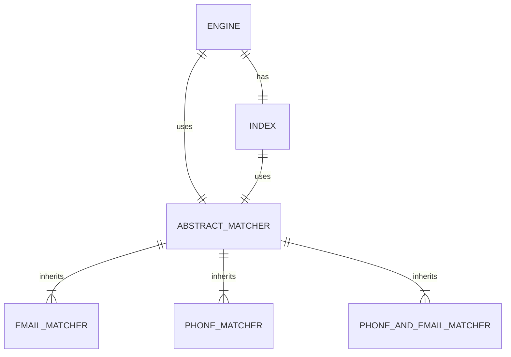

# Setting Up Project

## Installing Ruby

This application was written with Ruby 3.4.1, and it is recommended to maintain the same version of Ruby when running the code locally. Ruby can be installed using your preferred version manager, or using `rbenv` with the command below.

```sh
rbenv install 3.4.1
```

Instructions for installing `rbenv` for your chosen operating system can be found [in its GitHub repository](https://github.com/rbenv/rbenv).

## Install Bundler and Project Dependencies

Bundler is the preferred solution in the Ruby ecosystem for managing project dependencies. You must install Bundler and the project dependencies before running it. You can achieve that with the command below.

```sh
gem install bundler
bundle install
```

## Ensure bin/run is Executable

When attempting to run the application, you may encounter the following error:

```sh
permission denied: bin/run
```

You can resolve this error by making the file executable with the following `chmod` command.

```sh
chmod +x bin/run
```

# Running the Application

The application is run via the command line. The command that triggers the application requires two arguments.

1. Input File: The name of a file under the `/data` directory that is to be analyzed.
2. Matcher: The dimension to be matched on. One of `phone`, `email`, or `phoneandemail`.

Example invocations of the application can be seen below.

```sh
bin/run example.csv phone         # matches phone numbers
bin/run example.csv email         # matches email addresses
bin/run example.csv phoneandemail # matches both
```

# Domain Concepts



## Engine

The `Engine` is the main execution mechanism of the application. Running the executable ultimately invokes the `Engine#run` method.

## Index

The `Index` class establishes an ordered index of all results. This enables the application to quickly identify duplicate values when iterating, as the duplicate values will be next to each other.

The `Index` class is required due to the brute-force `n**2` algorithm being prohibitively slow on larger files like `/data/input3.csv`. By sorting the values before attempting to detect duplicates, the application becomes constrained by the `n log n` time complexity of Ruby's `sort` algorithm. This dramatically improves performance on large files like `/data/input3.csv`.

## AbstractMatcher and Children

These classes make up an inheritance hierarchy that perform duplicate-checking logic in the application. The matchers' naming convention is used in some metaprogramming, so the convention should be maintained for future matchers.

# Additional Considerations

## Shortcomings of Program

There's a tricky problem with rows matched by multiple columns. When matching on multiple columns, there's a risk that multiple matches will cause IDs to be overwritten. `/data/input2.csv` displays this issue well. A chunking approach in `Engine` helps mitigate this for basic cases (i.e., one entry in a matching group is also in another matching group). However, it does not solve the more complex case where multiple entries in a matching group have multiple matches. This limitation remains unsolved in the current implementation.

## Practicality Considerations

It should be noted that work like this typically takes place in more-traditional data analysis tools. It's unclear if spending further time on an automated solution like this to clean data is a wise use of time. In a real business environment, I'd advise against engaging in a development task like this.

## Data Sourcing Problems

Some of the provided data has serious issues. It would be worth the author's time to investigate why such dirty data is entering the database in the first place. Additionally, I put the `input3.csv` file and its result into a pivot table and found that each row has one exact duplicate in the file. Either the application producing this data has duplication issues (which would be very bad), or the data analysis team should be careful not to copy data twice in the future.
