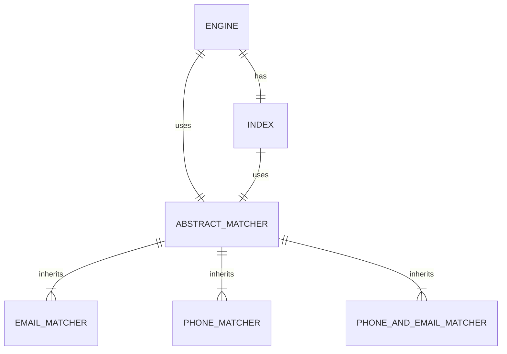

# Setting Up Project

## Installing Ruby

This application was written with Ruby 3.4.1, and it is recommended to maintain the same version of Ruby when running the code locally. Ruby can be installed using your preferred version manager, or using `rbenv` with the command below.

```sh
# Install Ruby 3.4.1
rbenv install 3.4.1
```

Instructions for installing `rbenv` for your chosen operating system can be found [in it's GitHub repository](https://github.com/rbenv/rbenv).

## Install Bundler and Project Dependencies

Bundler is the preferred solution in the Ruby ecosystem for managing dependencies on projects. You must install bundler and the dependencies of this project before attempting to run it. You can achieve that with the below command.

```sh
gem install bundler
bundle install
```

## Ensure bin/run is Executable

When attempting to run the application, you many encounter the following error,.

```sh
permission denied: bin/run
```

You can resolve this error by adding execution permissions to the file with the following `chmod` command.

```sh
chmod +x bin/run
```

# Running the Application

The application is run via the command line. The command that triggers the application requires two arguments.

1. Input File: The name of a file under the `/data` directory that is to be analyzed.
2. Matcher: The dimension to be matched on. One of `phone`, `email`, or `phoneandemail`.

Example invocations of the application can be seen below.

```sh
bin/run example.csv phone         # matches phone numbers
bin/run example.csv email         # matches email addresses
bin/run example.csv phoneandemail # matches both
```

# Domain Concepts


